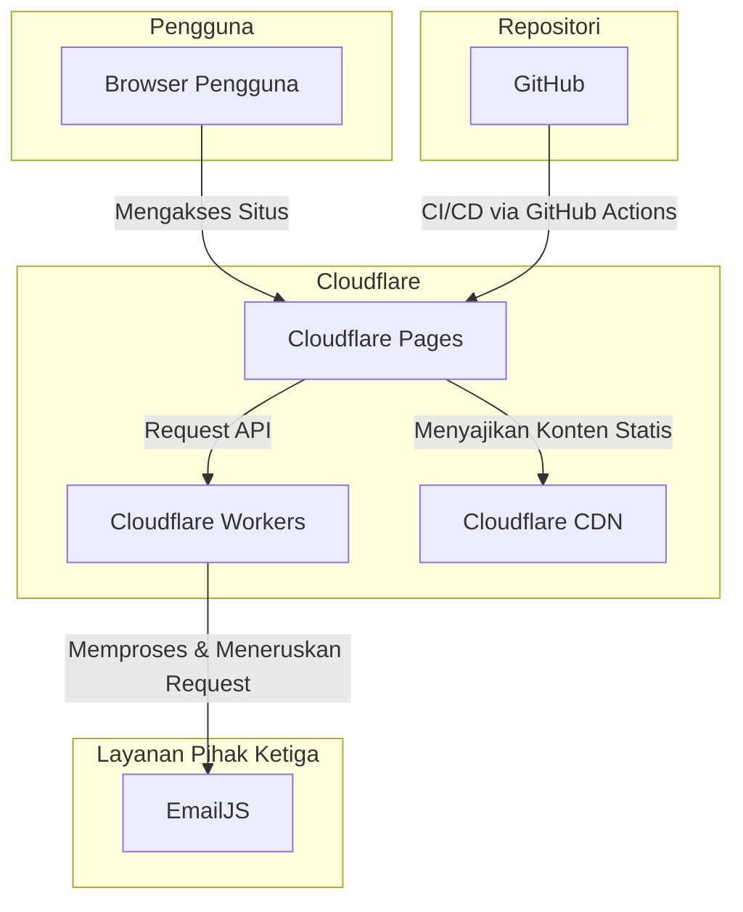

# Dokumentasi Arsitektur

Dokumen ini menjelaskan arsitektur teknis dari situs web maskom.co.id.

## 1. Diagram Arsitektur Tingkat Tinggi

Diagram berikut mengilustrasikan arsitektur keseluruhan dari aplikasi:

## 2. Penjelasan Struktur Komponen

Proyek ini menggunakan struktur direktori standar Next.js `app` dengan beberapa konvensi tambahan:

-   **`src/app/`**: Direktori utama untuk semua halaman dan rute. Setiap sub-direktori merepresentasikan sebuah segmen URL.
-   **`src/components/`**: Berisi semua komponen React yang dapat digunakan kembali, diorganisir berdasarkan fitur atau kategori (misalnya, `common/`, `home/`, `services/`).
-   **`src/data/`**: Berisi data statis yang digunakan di seluruh aplikasi, seperti konten layanan (`ServiceData.ts`) atau item menu (`MenuData.ts`). Ini memisahkan konten dari logika presentasi.
-   **`src/layouts/`**: Komponen layout utama, seperti Header dan Footer, yang digunakan di seluruh situs.
-   **`public/`**: Berisi semua aset statis seperti gambar, font, dan file SCSS utama.
-   **`public/assets/scss/`**: Direktori utama untuk file-file SCSS. Ini tidak konvensional untuk Next.js, tetapi merupakan pola yang digunakan dalam proyek ini.

## 3. Alur Data

### Alur Data Konten Statis:
1.  Data (misalnya, daftar layanan) didefinisikan dalam file TypeScript di `src/data/`.
2.  Komponen halaman (misalnya, `src/app/services/page.tsx`) mengimpor data ini.
3.  Data tersebut kemudian di-render menjadi HTML statis saat proses build (`npm run build`).
4.  HTML statis ini disajikan langsung dari Cloudflare Pages CDN untuk performa maksimal.

### Alur Data Formulir Kontak (EmailJS):
1.  Pengguna mengisi dan mengirimkan formulir kontak di browser.
2.  Komponen formulir di sisi klien menggunakan library EmailJS untuk mengirim data formulir langsung ke layanan EmailJS.
3.  Cloudflare Worker dapat digunakan sebagai perantara untuk menangani request ini, menambahkan lapisan keamanan atau logging jika diperlukan, sebelum meneruskannya ke EmailJS.
