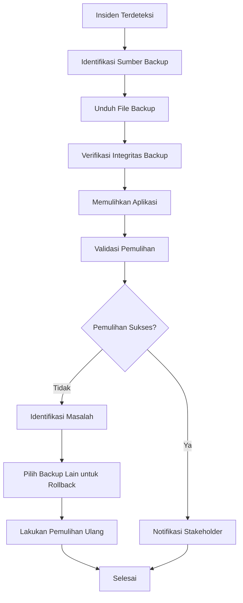

# Panduan Pemulihan Bencana (Disaster Recovery)

## Ikhtisar (Overview)

Dokumen ini menyediakan panduan langkah demi langkah untuk memulihkan sistem Maskom setelah terjadinya insiden yang menyebabkan hilangnya data atau downtime sistem. Tujuannya adalah untuk meminimalkan waktu pemulihan (RTO: Recovery Time Objective) dan mengurangi kehilangan data (RPO: Recovery Point Objective).

---

## Target Pemulihan (Recovery Targets)

### Target Waktu Pemulihan (RTO): 4 Jam
- **Definisi**: Waktu maksimal yang dibutuhkan untuk memulihkan operasional sistem penuh setelah insiden
- **Komponen**:
  - Memulihkan data backup: 15 menit
  - Memverifikasi integritas data: 2 menit
  - Memulihkan aplikasi: 5 menit
  - Validasi pemulihan: 10 menit
  - Notifikasi stakeholder: 5 menit

### Target Kehilangan Data (RPO): 24 Jam
- **Definisi**: Maksimum data yang dapat hilang (dalam jam) antara insiden dan backup terakhir
- **Strategi Backup**: Backup penuh mingguan, backup inkremental harian
- **Penyimpanan**: Lokal (localStorage) dengan enkripsi AES-256

---

## Strategi Backup

### Tipe Backup

1. **Backup Penuh (Full Backup)**
   - **Frekuensi**: Mingguan (setiap hari Minggu pukul 02:00)
   - **Isi**: Semua data pengguna, konten blog, pengaturan, dan log aktivitas
   - **Retensi**: Disimpan selama 30 hari
   - **Tujuan**: Sumber kebenaran untuk pemulihan

2. **Backup Inkremental (Incremental Backup)**
   - **Frekuensi**: Harian (setiap hari pukul 02:00)
   - **Isi**: Perubahan sejak backup penuh terakhir
   - **Retensi**: Disimpan selama 7 hari
   - **Tujuan**: Mengurangi ukuran backup dan waktu pemulihan

### Jadwal Otomatis

| Jadwal | Tipe Backup | Waktu Backup | Retensi |
|---------|-------------|--------------|----------|
| Harian  | Inkremental | 02:00 | 7 hari   |
| Mingguan | Penuh       | 02:00 | 30 hari  |

---

## Langkah-Langkah Pemulihan (Recovery Steps)

### Langkah 1: Identifikasi Sumber Backup (5 menit)

**Tujuan**: Memilih backup terbaru yang sesuai untuk pemulihan

**Tindakan**:
1. Akses Panel Manajemen Backup di `/admin/backups`
2. Lihat daftar backup yang tersedia
3. Filter backup berdasarkan:
   - Status: Sukses (completed)
   - Tipe: Penuh (full) atau Inkremental (incremental)
   - Tanggal: Urutkan dari yang terbaru
4. Pilih backup yang akan dipulihkan

**Kriteria Pemilihan**:
- Prioritaskan backup penuh terbaru
- Gunakan backup inkremental jika backup penuh terakhir terlalu lama
- Hindari backup yang gagal (status: failed)

---

### Langkah 2: Unduh File Backup (10 menit)

**Tujuan**: Mengunduh file backup ke mesin lokal untuk verifikasi

**Tindakan**:
1. Klik tombol "Unduh" (Download) pada backup yang dipilih
2. File backup akan diunduh dalam format `.json`
3. Simpan file ke lokasi yang aman di mesin lokal
4. Catat nama file dan lokasi untuk referensi

**Format File**:
- Nama file: `backup-YYYY-MM-DD-[type]-[random].json`
- Isi file: Data backup (terenkripsi jika dikonfigurasi)
- Enkripsi: AES-256 (jika diaktifkan)
- Kompresi: Gzip (jika diaktifkan)

---

### Langkah 3: Verifikasi Integritas Backup (2 menit)

**Tujuan**: Memvalidasi integritas backup sebelum pemulihan

**Tindakan**:
1. Buka file backup di editor teks
2. Cek bahwa file tidak kosong atau korup
3. Verifikasi checksum jika tersedia
4. Pastikan data terlihat terstruktur dengan benar

**Validasi**:
- [ ] File dapat dibuka tanpa error
- [ ] Struktur JSON valid
- [ ] Checksum cocok dengan metadata
- [ ] Data terlihat masuk akal (tidak acak)

---

### Langkah 4: Memulihkan Aplikasi (15 menit)

**Tujuan**: Mengembalikan sistem ke status sebelum insiden

**Tindakan**:
1. Akses Panel Manajemen Backup di `/admin/backups`
2. Klik tombol "Pulihkan" (Restore) pada backup yang dipilih
3. Baca dan konfirmasi peringatan pemulihan:
   - Data saat ini akan ditimpa
   - Pastikan untuk membuat backup baru sebelum memulihkan
   - Operasi tidak dapat dibatalkan
4. Klik "Mulai Pemulihan" untuk melanjutkan
5. Tunggu proses pemulihan selesai:
   - Memuat data backup
   - Memverifikasi integritas backup
   - Memulihkan data pengguna
   - Memulihkan data konten
   - Memulihkan pengaturan sistem
   - Memvalidasi pemulihan

**Proses Pemulihan**:
1. Memuat data backup
2. Memverifikasi integritas backup (checksum)
3. Mendekripsi data (jika terenkripsi)
4. Mendekompresi data (jika terkompresi)
5. Memulihkan data ke localStorage
6. Memuat ulang aplikasi

---

### Langkah 5: Validasi Pemulihan (10 menit)

**Tujuan**: Memastikan semua data telah dipulihkan dengan benar

**Tindakan**:
1. Periksa hasil pemulihan:
   - Waktu pemulihan total
   - Jumlah item yang dipulihkan
   - Error yang terjadi (jika ada)
   - Peringatan (jika ada)

2. Validasi data yang dipulihkan:
   - Buka dashboard admin dan verifikasi data
   - Cek konten blog: Semua postingan ada?
   - Cek pengguna: Pengguna dan peran ada?
   - Cek pengaturan: Konfigurasi sistem tersimpan?
   - Cek log aktivitas: Log aktivitas ada?

3. Uji fungsi kritis:
   - Buka halaman publik dan pastikan bisa diakses
   - Login ke akun admin dan pastikan bisa masuk
   - Coba akses fitur kritis (analitik, backup, dll.)

4. Catat hasil validasi:
   - Data yang berhasil dipulihkan
   - Data yang gagal dipulihkan
   - Masalah yang ditemukan
   - Langkah yang diambil untuk memperbaiki

---

### Langkah 6: Notifikasi Stakeholder (5 menit)

**Tujuan**: Menginformasikan stakeholder tentang status pemulihan

**Tindakan**:
1. Kirim email notifikasi ke:
   - Tim admin sistem
   - Tim pengembangan
   - Manajemen proyek
   - Stakeholder lain yang relevan

2. Konten notifikasi:
   - Status insiden (resolved/in-progress)
   - Waktu pemulihan selesai
   - Backup yang digunakan untuk pemulihan
   - Status pemulihan (success/partial/failed)
   - Langkah yang diambil
   - Masalah yang ditemukan

3. Saluran notifikasi:
   - Email (utama)
   - Slack/Discord (jika tersedia)
   - Dokumen project management (GitHub, Jira, dll.)

**Template Email**:
```
Subjek: [UPDATE] Pemulihan Sistem Maskom Selesai

Halo [Nama],

Pemulihan sistem Maskom setelah insiden telah selesai.

Status: Sukses
Backup yang Digunakan: backup-2025-12-15-full
Waktu Pemulihan: 15 menit
Item Dipulihkan: 42 item

Sistem sudah beroperasi normal. Silakan akses aplikasi dan lakukan validasi.

Jika Anda menemukan masalah atau keganjilan, silakan hubungi tim admin.

Terima kasih,
Tim Admin Maskom
```

---

## Daftar Periksa Validasi (Validation Checklist)

### Sebelum Pemulihan

- [ ] Identifikasi sumber backup yang benar
- [ ] Unduh dan simpan file backup secara lokal
- [ ] Verifikasi integritas backup (checksum)
- [ ] Pastikan untuk membuat backup baru sebelum memulihkan
- [ ] Catat waktu mulai pemulihan

### Selama Pemulihan

- [ ] Proses pemulihan dimulai
- [ ] Data backup dimuat dengan sukses
- [ ] Integritas backup diverifikasi
- [ ] Data pendekripsi (jika terenkripsi)
- [ ] Data dikompresi ulang (jika terkompresi)
- [ ] Data disimpan ke localStorage

### Setelah Pemulihan

- [ ] Semua data pengguna dipulihkan
- [ ] Semua data konten dipulihkan
- [ ] Semua pengaturan sistem dipulihkan
- [ ] Semua log aktivitas dipulihkan
- [ ] Aplikasi berfungsi normal
- [ ] Tidak ada error di konsol browser
- [ ] Semua fitur kritis berfungsi
- [ ] Stakeholder dinotifikasi
- [ ] Proses didokumentasikan

---

## Rencana Rollback (Rollback Plan)

### Skenario Rollback

1. **Pemulihan Gagal**
   - Jika pemulihan gagal, sistem mungkin dalam state yang tidak konsisten
   - **Tindakan**: Pulihkan ke backup lain yang lebih stabil

2. **Data Korup Setelah Pemulihan**
   - Jika data yang dipulihkan terdeteksi korup
   - **Tindakan**: Pulihkan ke backup sebelum insiden

3. **Fitur Rusak Setelah Pemulihan**
   - Jika fitur tertentu tidak berfungsi setelah pemulihan
   - **Tindakan**: Identifikasi data yang menyebabkan masalah dan perbaiki secara manual

### Langkah Rollback

1. **Hentikan Aplikasi** (jika mungkin)
2. **Pilih Backup untuk Rollback**:
   - Prioritaskan backup penuh yang stabil sebelum insiden
   - Hindari backup yang gagal atau tidak stabil
3. **Lakukan Pemulihan Ulang** (ulangi Langkah 4-6)
4. **Validasi Rollback**:
   - Pastikan sistem berfungsi normal
   - Verifikasi data yang dipulihkan
   - Lakukan uji komprehensif
5. **Dokumentasikan**:
   - Catat alasan rollback
   - Catat backup yang digunakan
   - Catat hasil rollback
   - Catat langkah perbaikan

---

## Kontak Darurat (Emergency Contacts)

### Utama (Primary Contact)
- **Nama**: System Administrator
- **Peran**: Primary Contact
- **Email**: admin@example.com
- **Telepon**: +62-21-1234-5678
- **Prioritas**: 1 (Utama)

### Teknis (Technical Contact)
- **Nama**: DevOps Engineer
- **Peran**: Technical Contact
- **Email**: devops@example.com
- **Telepon**: +62-21-8765-4321
- **Prioritas**: 2 (Kedua)

---

## Pelaporan dan Dokumentasi

### Laporan Insiden
1. Buat laporan insiden yang mencakup:
   - Tanggal dan waktu insiden
   - Jenis insiden (data loss, system failure, security breach)
   - Dampak insiden (data hilang, downtime, user impact)
   - Langkah yang diambil
   - Waktu pemulihan (RTO)
   - Data yang hilang (RPO)

2. Simpan laporan insiden di repositori dokumen atau project management tool

3. Tinjau laporan insiden dalam post-mortem meeting
   - Analisis akar penyebab
   - Identifikasi langkah yang dapat diperbaiki
   - Update rencana pemulihan bencana

### Dokumentasi Perubahan
1. Catat semua perubahan yang dibuat selama pemulihan:
   - Backup yang dipulihkan
   - Data yang dipulihkan
   - Masalah yang ditemukan
   - Perbaikan yang diterapkan
   - Validasi yang dilakukan

2. Update rencana pemulihan bencana berdasarkan pelajaran yang didapat

---

## Ringkasan Alur Kerja Pemulihan



---

## Pertanyaan Umum (FAQ)

### Q: Apa yang terjadi jika pemulihan gagal?
A: Sistem akan kembali ke state sebelum pemulihan. Anda dapat memilih backup lain untuk pemulihan.

### Q: Apakah data pengguna akan hilang selama pemulihan?
A: Tidak. Data pengguna yang ada tidak akan dihapus kecuali ditimpa oleh data dari backup yang dipulihkan. Selalu buat backup baru sebelum memulihkan.

### Q: Berapa lama waktu pemulihan?
A: Biasanya 15-30 menit, tergantung pada ukuran backup dan kompleksitas data.

### Q: Apakah sistem dapat diakses selama pemulihan?
A: Tidak. Sistem akan tidak tersedia selama proses pemulihan. Pengguna akan melihat pesan perawatan.

### Q: Apa yang terjadi jika sistem crash selama pemulihan?
A: Sistem akan berada di state yang tidak konsisten. Ikuti langkah rollback untuk memulihkan ke backup yang stabil.

### Q: Bagaimana cara mengetahui apakah pemulihan berhasil?
A: Validasi data yang dipulihkan, uji fungsi kritis, dan periksa apakah tidak ada error di konsol browser.

---

## Referensi

- [Backup Management Panel](/admin/backups)
- [Konfigurasi Backup](/admin/backups#config)
- [Riwayat Backup](/admin/backups#history)
- [Rencana Pemulihan Bencana](/admin/backups#disaster-recovery)

---

**Dokumen Terakhir Diperbarui**: 2026-01-18  
**Versi Dokumen**: 1.0.0  
**Pemilik Dokumen**: Tim Admin Maskom
